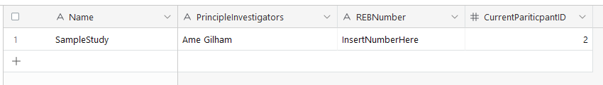

# RA-W23 - VR Study Generator

## Base Airtable Setup

To start you need to create an airtable base with at least 2 tables. 

The first table, by default called *StudyDetails* will have 4 fields with a single entry and look like the following. 

If you like you can add more fields to include additional metadata about your study, the most important part is that an integer number field named CurrentPariticpantID spelled that exact way exists as it will be used to identify the participant in survey answer tables later. 

The second table, by default called *Config*, represents the study’s configuration and is the overall flow the study will follow. 

It needs the following fields, remember the names need to be exact. 

**SegmentName** - *Text* - the name of the segment, this isn’t actually used but can help you identify the segment while editing later 

**Type** - *Select One (options: “Scene” or “Survey”)* - the type for that segment, scenes are custom scenes you create in unity, surveys are created out of airtable and all use the survey scene that comes with the unity package. 

**Order** - *Number (Integer)* - The order relative to all other segments that the user will enter this segment of the study, lower numbers occur first, this is necessary as the airtable API does not always download entries in order. 

**SceneName** - *Text* - The name of the custom scene you want to load at the beginning of the entry’s segment, it must match the name as seen in the build list in unity. You can leave this field blank for survey type segments as they have their own prebuilt scene included in the package. 

**SurveyQuestionTable** - *Text* - The name of another table within this same airtable base with a standardized format that contains all of the information about questions being asked in a survey segment. Can be left blank in scene type segments. See Airtable Survey Setup section for more information. 

**SurveyAnswerTable** - *Text* - The name of another table within this same airtable base where answers to the questions asked in this survey segment will be answered. 

**SurveyInstructions** - *Long Text* - Instructions that are displayed at the beginning of this segment assuming it is a survey segment. Can be left blank for a Scene Type segment.

**SurveyEndMessage** - *Text* - A message that is displayed as the title of the last page of a survey segment. Can be left blank for a Scene Type segment. 

**SurveyAcknowledgements** - *Text* - A message that is displayed as regular text on the last page of a survey segment. Can be left blank for a Scene Type segment.

The resulting config table should look something like this. 

Insert Image

You can use any combination of surveys and custom scenes in any order you like as long as it’s specified in the config file. 

Finally you will need a few things to connect this airtable base to unity. 

First make sure you have a copy of the url, it can be open on any table as long as you have the base you’re using for the study open. 

Next you will need your API key. Which can be retrieved by going to your account, accessing the developer hub, and creating an API key. 

**Note: API keys will be deprecated by the end of January 2024, their replacement Personal Access Tokens should still work with the study generator system however this has not been tested.** 

**Note: Always remove your API key before making a commit to a repository as it is tied to your account not the base itself and should be set later. An as of writing incomplete development task is to find a more secure way of storing API keys in unity.** 

## Base Unity Setup

To start with unity setup add the [package](https://github.com/syberspaz/RA-W23/releases/tag/Version-1.0-April-23rd-2023) to your unity project. Note the package was built using Unity Version 2021.3.13f1 however it should work in comparable versions of unity. 

Open the scene BaseScene, and on the study manager object you need to enter some data. 

The Api Version should be V0 

The Airtable URL should be the url saved at the end of the Base Airtable Setup section. The app key will be extracted from the url. 

The Api key should be the Api Key obtained at the end of the Base Airtable Setup section. **Remember to remove your Api key before making any commits.**

The Config Table should be the name of the Config table from the Base Airtable Setup section, by default it should be called Config but if you rename it in Airtable the name should be reflected here too. 

The Study Details Table should be the name of the StudyDetails table from the Base Airtable section, again by default it should be called StudyDetails but if it’s renamed in Airtable the name should be reflected in this study manager object. 

And that is all the basic setup you need in unity. The next two sections will now cover how to set up both scenes custom to your study and surveys so you can ask participants questions at various points in the study and get their answers saved to airtable. 

## Survey Setup

The survey system works with an existing scene in Unity named SurveyScene please ensure this scene is added to the Build Setting scene list. The survey system integrates [VR Questionnaire](https://github.com/syberspaz/VRQuestionnaireToolkit). As seen in the Base Airtable Setup section each survey requires two sets of tables, a table that lists all of the questions and a table to receive participant answers. 

Starting with the table to list questions, while you can name this table whatever (as long as the name is reflected with the segment you want in the Config table) it does have a standardized format. With the following fields

**ID** - *text* - The ID of the question / page, for questions this ID will be used to save things to the answer table later 

**Type** - *Select One (Page - Select, Page - Scale, Page - Dropdown, Select One, Scale, Dropdown)* - This is the type of the page or question. The first entry should always be a page, and while it is recommended each question has a new page before it you can combine questions of the same type on the same pages but when moving to a question of a different type you must first put an entry starting a new page of that type. 

**Order** - *Number (Integer)* - The order the entries are processed when creating the surveys in unity, again you must have a new page every time a question type changes and they must be ordered correctly with lower order numbers appearing first. 

**Text** - *Text* - This is the text that is displayed for the question, this is where you put the actual question that you want the user to answer. Can be left blank for pages.

**ScaleMin** - *Number (Integer)* - The minimum value for a scale question, you usually want this set to 1 but it can be set to whatever. Can be left blank for any Type other than Scale.

**ScaleMax** - *Number (Integer)* - The maximum value for a scale question, the difference between this and ScaleMin will be the number of notches available to the user when answering the question, you usually want this set to 5 or 10 but it can set to whatever. Can be left blank for any Type other than Scale. 

**ScaleLowLabel** -  *Text* - The label for the low end of a scale question, the label for the minimum value. Can be left blank for any Type other than Scale. 

**ScaleHighLabel** - *Text* - The label for the high end of a scale question, the label for the maximum value. Can be left blank for any Type other than Scale. 

Insert Image
*Setup example of a scale question and what it looks like in unity.*

**OptionCount** - *Number (Integer)* - The number of options available for a select one or dropdown question, should be between 1 and 7 (the system only supports a max of 7 options per question). Can be left blank for Types other than Select One or Dropdown. 

**Option1** through **Option7** - *Text* - From here there should be 7 different fields for different options named Option with the number for that option written out afterwards, these should be filled consecutively up to the number you specified in the option count field. Can be left blank for Types other than Select One or Dropdown, and for options that aren’t being used. 

Insert Image
*Setup example of a Select One question and what it looks like in Unity.*

The final table should end up looking something like this example. 

Insert Image

From there you can make an answer table for this survey. The answer table is not a fixed format but is instead based on your question. 

The first field of the answer table should always be an **ID** - *Number (Integer)* - This will identify the participant whose answers this entry corresponds to, based on the participant ID from the StudyDetails table. 

From there, there should be one field for each question in the question table. **Each field should be named the same as the ID of that question in the question table**. As for the types of each field. **Fields accepting answers for Scale questions should accept integer numbers. While fields for the answers to Select One and Dropdown questions should be single line text fields.** 

Thus an answer table for the full question table in the screenshot above would look like this. 

Insert Image

With each of those entries having been generated from responses received in unity and automatically uploaded using the table names specified in the Config table. 

## Custom Scene Setup

Custom scenes will form the core of your study, these are where you’ll put any content you want 

First thing to note is that your custom scenes **DO NOT** need an object with the study manager script, as long as you’re launching from a scene that does (such as the BaseScene that comes with the project) as the StudyManager is a singleton that persists between scenes. 

The XR Origin prefab can be used to give you a default camera, hands, and interaction reticles that will work with both built in unity UI and Echo Plus (we’ll come back to Echo Plus briefly). If you’re using the XR Origin Prefab you should also create another object that has the **XR Interaction Manager** script attached to it and your **Event System Object** should have a **XR UI Input Module** attached. 

The actual content of your custom scenes is up to you however, the most important parts for the tool is that the scene is properly added to the build settings, and that is named the same way as it is listed in the associated segment in the Config table on Airtable, and that when the scene is done the next segment function on the study manager is called. This can be called in code using **StudyManager.Instance.NextSegment();** a StudyAcessFunctions script with a public NextSegment function that calls the StudyManager’s next segment also exists for use with for example UI buttons (this is used in the prebuilt SurveyScene). 

### Using Echo Plus

Finally the tool integrates [Echo Plus](https://github.com/syberspaz/Echo_Plus) to allow you to record what participants do in your custom scenes and play it back later. **It is not currently possible for Echo Plus files to be automatically saved to airtable** however if wish to you can create another table and manually upload files. 

To record a scene using Echo Plus you first need an object with the **Recording_Manager** and **Automatic_Recording_Manager** scripts attached, the automatic recording manager script will have fields for where you want to save the static and dynamic data for the scene, noting that if you have exactly the same file names for different scenes the data will be overwritten with the most recent scene’s recordings, you want the record checkbox to be selected, a short start delay so it does not record while the scene is still loading (I recommend 5 seconds for in editor, however a shorter time may be appropriate for builds) and I recommend that Display Dialogue be turned off (if on it will open a pop up that must be dismissed when the scene ends and it stops recording). 

While Echo Plus has its own documentation you can look through, a quick overview of setting up a scene to be recorded. 

**Static environmental objects** should have a **Recording_Object** script that is set to Is_Static and has **RecTrack_Position**, **Rec_TrackRotation**, **RecTrack_Scale**, and a **RecTrack_Renderables** attached script as tracked components. 

Meanwhile **Dynamic moving objects** should have all of the same components but with isStatic off, and an additional tracked component called **RecTrack_Lifetime**. The data format for the Renderables and Lifetime trackers should both be F3. 

**Cameras** should be set up the same as a dynamic moving object however it generally does not need a RecTrack_Renderables component and does need a **RecTrack_Camera** script with data format F3 and the target camera set. 

If you are tracking an object that does not have a regular mesh renderer such as for example an object with a Skinned Mesh Renderer or an object that is not normally rendered you can set the RecTrack_Renderables to manual override and put a manual mesh and material that will be used in the playback later. **It is not currently possible to record and playback skinned mesh renderer animations using Echo Plus.** 

When going to play back the scene you can go to the VisualizationPlayback scene that comes with Echo_Plus/The tool and in the visualization manager, select override file locations and put the file locations and names of the saved recording, hit play and navigate through the scene. 
